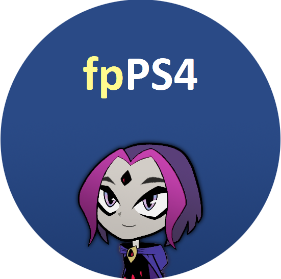
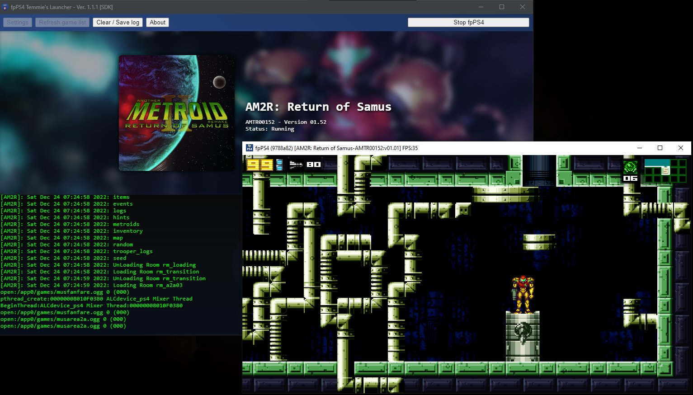

<h1 align="center">
	<br>
	fpPS4 Temmie's Launcher
</h1>

Created by TheMitoSan _(Previously known as TemmieHeartz)_, This is a simple launcher created for [fpPS4](https://github.com/red-prig/fpPS4) compatibility layer.

<p align="center">
	
</p><br>

## How to install

### Windows

#### Stable Version

- Download latest release (you can get it [here](https://github.com/themitosan/fpPS4-Temmie-s-Launcher/releases))
- Extract all files on your desired location
- Run `Launcher.exe`

#### Latest Features (recommended)

- [Download / Clone this repo](https://github.com/themitosan/fpPS4-Temmie-s-Launcher/archive/refs/heads/main.zip)
- Download [nw.js](https://dl.nwjs.io/v0.70.1/nwjs-sdk-v0.70.1-win-x64.zip) version `0.70.1`
- Extract all files from `nw` on `Nwjs` folder
- Run `Launcher.bat`

If you want to update launcher and have `git` installed, run these commands below:

```
git reset --hard
git pull origin main
```

### Linux [WIP]

**WARNING**: Running fpPS4 / Launcher on a Non-Windows OS <u>**isn't the best way / recommended to test / use this software!**</u> The main compatibility layer is being developed to <u>**run only on Windows**</u>. In order to run fpPS4, you will need [Wine](https://www.winehq.org) installed - but be aware that it will result in less performance with bugs / glitches.

[Click here to know how to install Wine](https://wiki.winehq.org/Download)

- [Download / Clone this repo](https://github.com/themitosan/fpPS4-Temmie-s-Launcher/archive/refs/heads/main.zip)
- Download [nw.js](https://dl.nwjs.io/v0.70.1/nwjs-sdk-v0.70.1-linux-x64.tar.gz) version `0.70.1`
- Extract all files from `nw` on `Nwjs` folder
- Open terminal on main project path and run `chmod +x ./Launcher.sh`
- To start, run `./Launcher.sh`

### How to import your dumps
You can see all required procedures on main [fpPS4 discord server](https://discord.gg/up9qatpX7M).

## External plugins used on this project
- [memoryjs](https://github.com/rob--/memoryjs) - created by [Rob--](https://github.com/rob--)
- [node-stream-zip](https://github.com/antelle/node-stream-zip) - created by [antelle](https://github.com/antelle)
- [TMS.js](https://github.com/themitosan/TMS.js) by [TheMitoSan](https://github.com/themitosan) <sup>*(Hi!)*</sup>

<p align="center">

_**IMPORTANT**: This software does not allow you to obtain free PS4 Games / Apps._

</p>